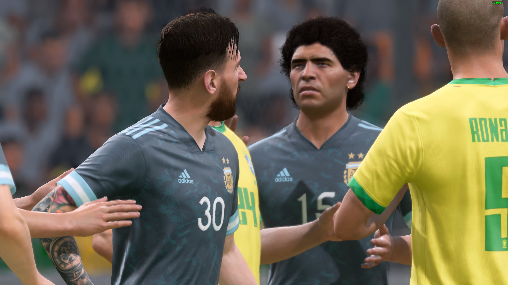

# Fifa22 Icons Unlocked

## Icons unlocked for all modes, and much more

---
# Overview

---
# Usage

1. Download the `Squads` [file](https://github.com/Armen-Jean-Andreasian/Fifa22-Icons-Unlocked/blob/main/README.md) from repository (nubers in the end don't matter)
2. Replace the existing `Squads` file with the downloaded file in `C:\Users\pc\Documents\FIFA 22\settings` directory.
3. Run the game.
4. Customise -> Profile -> Load Squad and choose `Icons Premium World`

